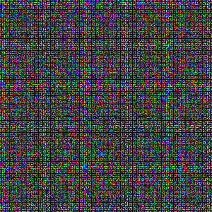
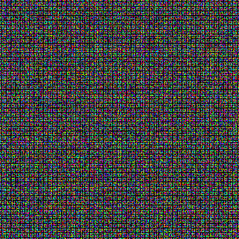
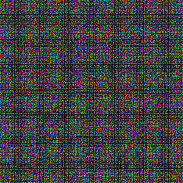
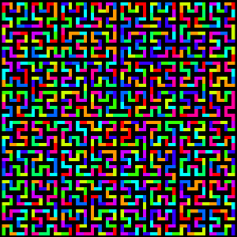
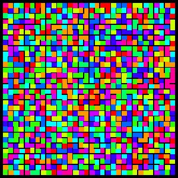
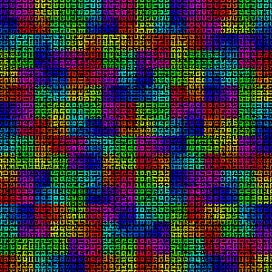
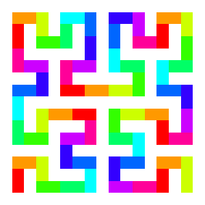

# pi

Idea of this project was to visualize pi by means of a hilbert polygon.

## Results

[](src/main/resources/minwidth-12-8193.png)   
pi 16,777,215 digits

[](src/main/resources/minwidth-random-12-8193.png)   
random 16,777,215 digits

[](src/main/resources/minwidth-10-2049.png)   
pi 1,048,575 digits

[](src/main/resources/demo1.png)   
pi 1,023 digits

[](src/main/resources/pi-5-colorful.png)   
pi 1,023 digits  

These have noting to with pi. They just look nice.

[](src/main/resources/inc-color-hue-long-XL.png)

# Length of a hilbert polygon

```
+---------+---------------------+
| depth   | lengh               |
+---------+---------------------+
|       1 |                    3|
|       2 |                   15|
|       3 |                   63|
|       4 |                  255|
|       5 |                1.023|
|       6 |                4.095|
|       7 |               16.383|
|       8 |               65.535|
|       9 |              262.143|
|      10 |            1.048.575|
|      11 |            4.194.303|
|      12 |           16.777.215|
|      13 |           67.108.863|
|      14 |          268.435.455|
|      15 |        1.073.741.823|
|      16 |        4.294.967.295|
|      17 |       17.179.869.183|
|      18 |       68.719.476.735|
|      19 |      274.877.906.943|
|      20 |    1.099.511.627.775|
|      21 |    4.398.046.511.103|
|      22 |   17.592.186.044.415|
|      23 |   70.368.744.177.663|
+---------+---------------------+
```
# Resources for math constants

https://archive.org/details/Math_Constants

* Download the zipfile
* Extract the dezimal part from it
* Rename that part pi.txt
* Move it to $HOME/work/pi

## Performance of reading digits from text files.

```
  100,000,000 - 12s
1,000,000,000 - 92s
```
# Minimum resolution to show a hilbert curve.

Minimum size of the canvas for a polygon of depth n means
that the line and space between the polygon is one pixel. 

len = pow(2, n + 1) + 1




```text
+-------+----------------+
| depth | resolution[px] |
+-------+----------------+
|     1 |              5 |
|     2 |              9 |
|     3 |             17 |
|     4 |             33 |
|     5 |             65 |
|     6 |            129 |
|     7 |            257 |
|     8 |            513 |
|     9 |           1025 |
|    10 |           2049 |
|    11 |           4097 |
|    12 |           8193 |
|    13 |          16385 |
|    14 |          32769 |
|    15 |          65537 |
+-------+----------------+
```

# JavaScript Libraries to Create Interactive and Customized Maps

https://www.hongkiat.com/blog/javascript-libraries-for-interactive-maps/

# Create tiles using 

```
docker run -it -u 1000:1000 -v /home/wwagner4:/home osgeo/gdal sh
```

Inside the container navigate to the image you want to split into tiles /home/.../your-iamge.png

There call:
```
gdal2tiles.py -p raster -r near -z 4-10 your-image.png your-output-directory
```
